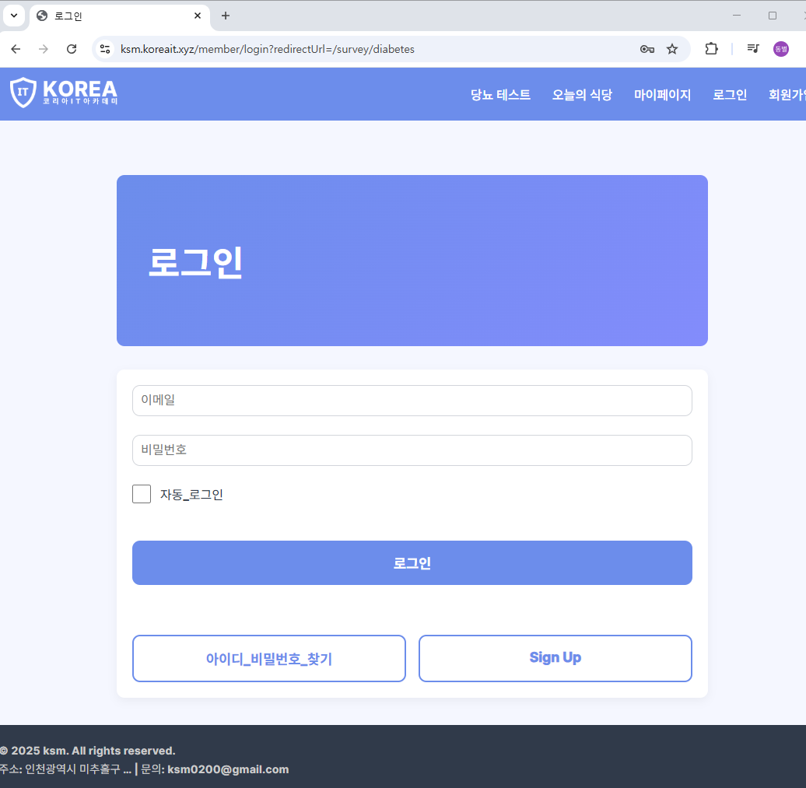
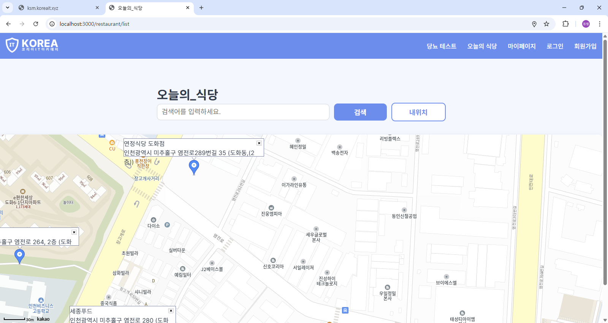
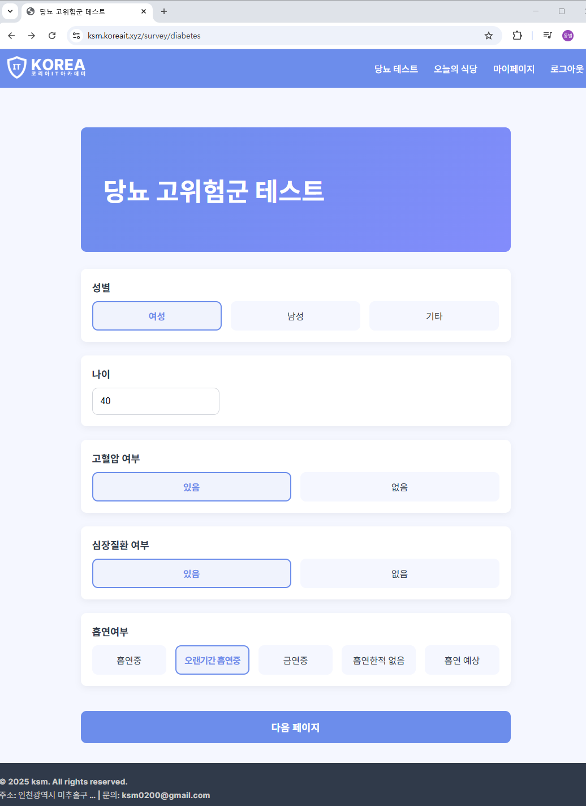
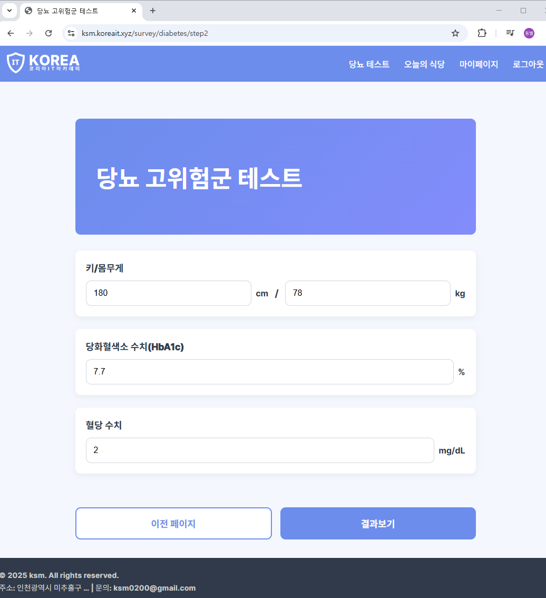
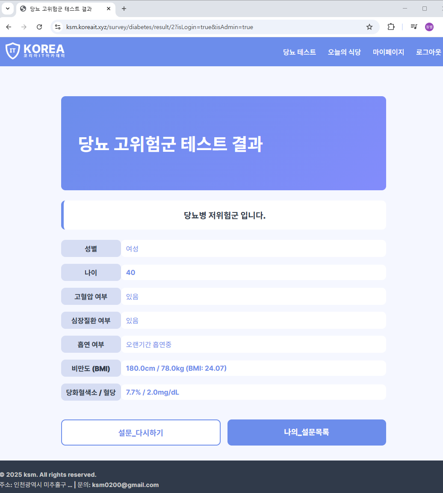

# Secondhand 트렌드 분석 시스템

## 소개

`secondhand` 프로젝트는 중고거래 플랫폼과 연동된 다양한 기능을 제공하는 Spring Boot 애플리케이션입니다. 주요 기능으로는 상품 및 회원 관리, 트렌드 분석, 식당 추천, 당뇨 고위험군 설문 테스트 등이 포함되어 있습니다.

## 주요 기능

* **상품 관리**: 상품 등록, 수정, 삭제, 조회 기능
* **회원 관리**: 회원 가입, 로그인, 정보 수정 기능
* **마이페이지**: 회원별 대시보드 제공
* **트렌드 분석**: 키워드 수집 및 워드클라우드/차트 생성 기능 (`/trend`)
* **식당 추천**: 오늘의 식당 목록 조회 및 검색 기능 (`/restaurant`)
* **당뇨 고위험군 테스트**: 설문을 통한 당뇨 위험도 예측 기능 (`/survey/diabetes`)
* **파일 업로드**: 이미지 및 파일 저장 기능
* **관리자 기능**: 관리자 전용 기능 (`/admin`)

## 기술 스택

* **Backend**: Java 21, Spring Boot 3.5.0, Spring Data JPA, Spring Validation, Thymeleaf
* **Database**: MySQL 
* **ORM**: JPA, Spring Data
* **Build Tool**: Gradle
* **API 문서**: Springdoc OpenAPI (Swagger UI)
* **Containerization**: Docker

## 사전 요구사항

* Java 21 이상 설치
* Gradle Wrapper 사용 가능 (`./gradlew`)
* MySQL 데이터베이스

## 설치 및 설정

1. 저장소 클론

   ```bash
   git clone <repository-url>
   cd secondhand
   ```
2. 환경 변수 설정
   `application.yml` 또는 Docker 환경 변수로 다음 값을 설정하세요:

   ```yaml
   DB_URL: <your_db_url>
   DB_USERNAME: <username>
   DB_PASSWORD: <password>
   SPRING_PROFILES_ACTIVE: default,prod
   ```
3. 의존성 설치 및 빌드

   ```bash
   ./gradlew clean build
   ```

## 실행

### 로컬

```bash
java -Ddb.url=$DB_URL \
     -Ddb.username=$DB_USERNAME \
     -Ddb.password=$DB_PASSWORD \
     -Dspring.profiles.active=$SPRING_PROFILES_ACTIVE \
     -jar build/libs/secondhand-0.0.1-SNAPSHOT.jar
```

서버가 `http://localhost:3000`에서 실행됩니다.

### Docker

```bash
docker build -t secondhand:latest .
docker run -p 3000:3000 \
  -e DB_URL=$DB_URL \
  -e DB_USERNAME=$DB_USERNAME \
  -e DB_PASSWORD=$DB_PASSWORD \
  -e SPRING_PROFILES_ACTIVE=default,prod \
  secondhand:latest
```

## API 문서

* Swagger UI: `http://localhost:3000/swagger-ui/index.html#/`
* OpenAPI Docs: `http://localhost:3000/api-docs`

## 주요 엔드포인트

### 식당 추천 (`/restaurant`)

* `GET /restaurant/list` : 오늘의 식당 목록 조회 (뷰 화면 렌더링)
* `GET /restaurant/search?skey={검색어}` : 검색어 기반 식당 목록 JSON 반환
* `GET /restaurant/train` : 전체 식당 데이터 JSON 반환

### 당뇨 고위험군 테스트 (`/survey/diabetes`)

* `GET /survey/diabetes` 또는 `/survey/diabetes/step1` : 설문 시작 페이지
* `POST /survey/diabetes/step2` : 1단계 설문 처리 후 2단계 이동
* `POST /survey/diabetes/process` : 설문 최종 처리 및 예측
* `GET /survey/diabetes/result/{seq}` : 예측 결과 조회

## 프로젝트 구조

```
secondhand/
├─ src/
│  ├─ main/
│  │  ├─ java/org/koreait/
│  │  │  ├─ admin/
│  │  │  ├─ file/
│  │  │  ├─ member/
│  │  │  ├─ mypage/
│  │  │  ├─ product/
│  │  │  ├─ restaurant/
│  │  │  ├─ survey/diabetes/
│  │  │  ├─ trend/
│  │  │  ├─ global/
│  │  │  └─ validators/
│  ├─ resources/
│  │  ├─ application.yml
│  │  └─ templates/
├─ build.gradle
├─ settings.gradle
├─ Dockerfile
└─ README.md
```

--------------------------------------


## NewsTrendService 기능 요약
  - python 가상환경 활성화
  - 특정 파이썬 스크립트 실행 (trend.py)
  - 결과(JSON)를 NewsTrend로 역직렬화
  - 결과 이미지를 특정 경로에 저장하고, DB에 저장
  - 매 시간마다 실행하는 @Scheduled 작업 포함

-------------------------------------------------------

# 파일 공통 모듈
- 고려할점
  - 같은 명칭 파일을 같은 경로로 올렸을 경우 기존 파일이 덮어씌어지는 문제해결
    - 중복없는 파일명으로 변환해서 파일을 업로드 -> 혹시라도 다운로드 하는 기능을 만든다면? 
      일반적인 요구사항은 파일명이 변경되어 서버로 업로드 된다더라도 업로드 시점의 파일명으로 다운로드 되기를 원한다.
    - 파일 업로드 전, 파일 정보를 DB에 기록, 추가될때 생성된 증감번호(seq)로 파일명을 변경해서 서버로 저장
    - 하나의 폴더에 너무 많이 파일이 있으면 조회시 느려진다. -> 분산해서 저장
    - 10의 나머지를 구하면 0~9, 0~9로 폴더를 생성하고 분산해서 저장
  - 파일 정보 저장 -> 파일 업로드 완료
  
- 게시글 1개 - 그룹(gid)
  - 에디터에 첨부하는 이미지 - 위치(에디터) - location
  - 다운로드를 위한 첨부파일 - 위치(첨부파일)
    
- 상품 1개 - 그룹
  - 메인 이미지
  - 목록 이미지
  - 상세 설명 이미지...

### @CreatedBy : 로그인한 사용자의 정보 자동 기록
- AuditorAware 인터페이스 구현
  - 자동으로 @CreatedBy에 설정될 로그인한 회원정보가 무엇인지를 설정

### 파일 다운로드
- 브라우저의 출력 방향을 웹브라우저가 아니라 특정 파일명으로 변경하면 다운로드가 된다.
- 응답 헤더 : Content-Disposition: attachment; filename=파일명
  - 바디에 출력되는 데이터가 파일명으로 다운로드 된다.

### 썸네일 생성
- 경로
- uploads/thumbs/1/너비_높이_1.png
- 같은 경로에 같은 너비, 높이의 썸네일이 있으면 따로 생성 X

---

## 구현 화면
### 메인 화면


### 오늘의 식당 화면


### 당뇨설문 화면



